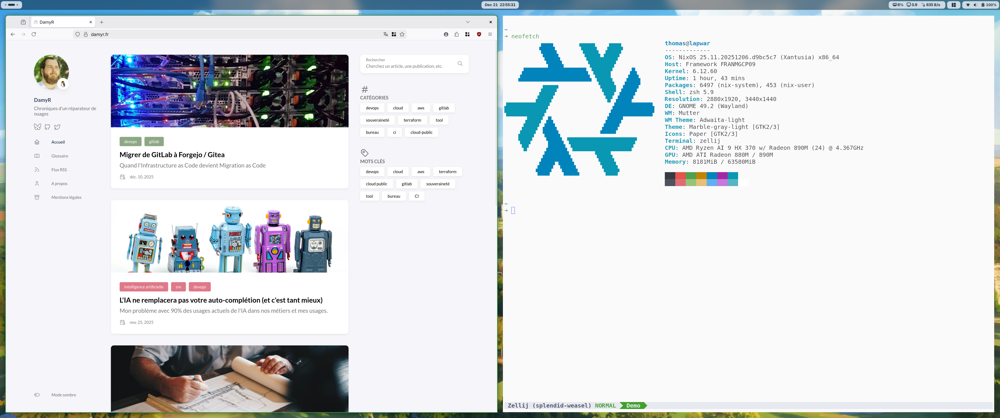

# NixOS Configuration

Personal NixOS configuration using flakes and home-manager.

## Overview

This repository contains declarative NixOS configurations for multiple machines, organized into modular components for easy maintenance and reusability.



## Machines

- **ghost** - Desktop system (user: damyr)
- **lapwar** - Laptop system with professional tools (user: thomas)

## Project Structure

```
.
├── flake.nix                 # Main flake configuration
├── hosts/                    # Host-specific configurations
│   ├── ghost/
│   │   └── configuration.nix
│   └── waays/
│       ├── configuration.nix
│       └── disko.nix
└── modules/                  # Modular configuration components
    ├── core/                 # System-level configuration
    │   ├── default.nix
    │   ├── user.nix
    │   ├── packages.nix
    │   ├── security.nix
    │   ├── services.nix
    │   └── system.nix
    ├── desktop/              # Desktop environments
    │   ├── default.nix
    │   ├── gnome.nix
    │   └── hyprland.nix
    ├── home/                 # Home-manager configurations
    │   ├── default.nix
    │   ├── home.nix
    │   ├── home-manager.nix
    │   ├── kitty.nix
    │   ├── neovim.nix
    │   └── zellij.nix
    └── profiles/             # Machine-specific profiles
        ├── default.nix
        └── packages.nix      # Pro laptop packages
```

## Module Organization

### Core Modules
System-level configuration shared across all machines:
- **user.nix** - User account configuration
- **packages.nix** - Base system packages
- **security.nix** - Security settings (AppArmor, firewall, etc.)
- **services.nix** - System services
- **system.nix** - Basic system settings (timezone, locale, networking)

### Desktop Modules
Desktop environment configurations:
- **gnome.nix** - GNOME desktop environment
- **hyprland.nix** - Hyprland window manager

### Home Modules
User-level configurations via home-manager:
- **home.nix** - Shell configuration (zsh, starship, aliases)
- **kitty.nix** - Kitty terminal emulator
- **neovim.nix** - Neovim editor
- **zellij.nix** - Zellij terminal multiplexer

### Profile Modules
Machine-specific configurations:
- **pro** - Professional laptop packages (Framework laptop tools, Mattermost, etc.)

## Installation

### Initial Setup

1. Clone this repository:
```bash
git clone <repository-url> ~/nixos-config
cd ~/nixos-config
```

2. Build the configuration for your machine:
```bash
sudo nixos-rebuild switch --flake ~/nixos-config#<hostname>
```

Replace `<hostname>` with either `ghost` or `lapwar`.

### Using the Alias

After the first rebuild, you can use the convenient alias:
```bash
nixupgrade
```

This automatically rebuilds the system for the current hostname.

## Making Changes

### Adding System Packages

Edit `modules/core/packages.nix` and add packages to the `environment.systemPackages` list:
```nix
environment.systemPackages = with pkgs; [
  # Your new package here
  package-name
];
```

### Adding User Packages

Edit `modules/home/home.nix` and add packages to the `home.packages` list:
```nix
home.packages = with pkgs; [
  package-name
];
```

### Adding Professional Packages (lapwar only)

Edit `modules/pro/packages.nix`:
```nix
home.packages = with pkgs; [
  package-name
];
```

### Modifying Shell Aliases

Edit the `shellAliases` section in `modules/home/home.nix`:
```nix
shellAliases = {
  alias-name = "command";
};
```

## Features

### System Configuration
- **OS**: NixOS 25.11
- **Shell**: Zsh with starship prompt
- **Terminal**: Kitty with custom light theme
- **Editor**: Neovim with custom configuration
- **Desktop**: GNOME (configurable)
- **Security**: AppArmor, ClamAV, automatic updates
- **Garbage Collection**: Automatic cleanup of old generations (7 days)

### Development Tools
- **Languages**: Python, Node.js, Go, Ruby
- **DevOps**: kubectl, k9s, terraform, opentofu, helm
- **Cloud**: Google Cloud SDK, OpenStack client, Scaleway CLI
- **Containers**: Podman, buildah, podman-compose
- **Virtualization**: virt-manager, vagrant

### Key Packages
- `tree` - Directory structure visualization
- `ripgrep` - Fast text search
- `fzf` - Fuzzy finder
- `kubectl` / `k9s` - Kubernetes management
- `terraform` / `opentofu` - Infrastructure as Code
- `pass` - Password manager
- `claude-code` - AI development assistant

### Professional Tools (lapwar)
- `mattermost-desktop` - Team communication
- `framework-tool` - Framework laptop utilities
- `framework-tool-tui` - Framework laptop TUI
- `crush` - Shell scripting helper

## Git Configuration

The configuration includes global git settings:
- **Editor**: neovim
- **GPG Signing**: SSH key signing enabled
- **Useful aliases**: `lg` (pretty log), `am` (amend)
- **Pull strategy**: rebase

## Customization

### Changing Theme
The Kitty terminal uses a light theme (One Light inspired). To modify:
```bash
nvim modules/home/kitty.nix
```

### Changing Desktop Environment
Currently configured for GNOME. To switch to Hyprland or add another DE, modify the imports in your host-specific configuration.

### Adding a New Machine

1. Create a new directory in `hosts/`:
```bash
mkdir -p hosts/new-machine
```

2. Create `hosts/new-machine/configuration.nix`

3. Add the configuration to `flake.nix`:
```nix
new-machine = nixpkgs.lib.nixosSystem {
  system = "x86_64-linux";
  specialArgs = {
    username = "your-username";
    hostname = "new-machine";
  };
  modules = [
    ./hosts/new-machine/configuration.nix
    ./modules/core
    ./modules/desktop
    ./modules/home
    # Add other modules as needed
  ];
};
```

## Maintenance

### Update Flake Inputs
```bash
nix flake update
```

### Garbage Collection
Automatic garbage collection runs periodically, removing generations older than 7 days.

Manual garbage collection:
```bash
sudo nix-collect-garbage --delete-older-than 7d
```

### List Generations
```bash
sudo nix-env --list-generations --profile /nix/var/nix/profiles/system
```

### Rollback
```bash
sudo nixos-rebuild switch --rollback
```

## Troubleshooting

### Build Fails
1. Ensure all files are tracked by git (flakes only include tracked files)
2. Check for syntax errors in nix files
3. Use `--show-trace` for detailed error messages:
```bash
sudo nixos-rebuild build --flake ~/nixos-config#<hostname> --show-trace
```

### Git Permission Issues
If you encounter git permission errors:
```bash
sudo chown -R $USER:users ~/nixos-config/.git
```

## License

Personal configuration - use at your own risk.

## Credits

- NixOS: https://nixos.org
- Home Manager: https://github.com/nix-community/home-manager
- Disko: https://github.com/nix-community/disko
